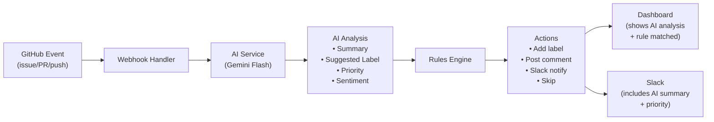
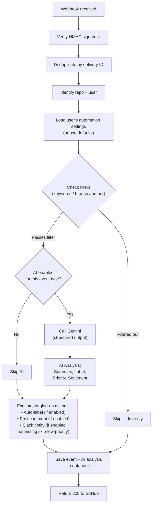

# Architecture Specification: AI Triage Integration & Configurable Automation Engine

This specification details the design and implementation of automated LLM-powered triage and a user-configurable rules engine within the event-driven webhook pipeline.

---

## Architectural Rationale: Coupling AI Triage with Rule Automation

Rather than treating AI as an isolated add-on, the LLM triage directly informs and drives downstream rule evaluation and notification routing:



By streaming AI classification (such as priority `P0-P3` and categorization tags) into the automation rules engine, users can establish granular workflows—for example: *"If AI priority is P0-critical, apply label `critical` and trigger an immediate Slack alert; if P3-low, skip notifications to avoid alert fatigue"*.

---

## Feature 1: AI Integration (Gemini Service)

### Functional Overview

When a webhook event arrives, the ingestion service passes issue/PR text to Gemini and receives a strictly typed, structured response:

| Event Type | AI Analyzes | AI Returns |
|---|---|---|
| `issues` (opened) | Title + body | Summary, suggested label, priority (P0-P3), sentiment |
| `pull_request` (opened) | Title + body + branch name | Summary, complexity estimate, risk flags |
| `push` | Commit messages (batch) | Changelog summary |

### Model Selection & Operational Constraints

- **Selected Model**: `gemini-2.0-flash`
- **Structured Output**: Native JSON mode with Pydantic schemas — eliminates brittle regex/markdown parsing
- **Low Latency**: Sub-2s p95 response time, well within webhook delivery timeouts
- **SDK**: `google-genai` (current generation unified SDK)

### Exact Implementation

---

#### New File: `backend/app/services/ai.py`

This is the AI service module. Clean, isolated, testable.

```python
"""
AI-powered issue/PR analysis using Google Gemini.
Returns structured analysis: summary, suggested label, priority, sentiment.
"""

from google import genai
from pydantic import BaseModel, Field
from enum import Enum
from typing import Optional
import logging

from app.config import settings

logger = logging.getLogger("ai")


# ── Structured Output Schemas ────────────────────────────────

class Priority(str, Enum):
    P0_CRITICAL = "P0-critical"
    P1_HIGH = "P1-high"
    P2_MEDIUM = "P2-medium"
    P3_LOW = "P3-low"

class SuggestedLabel(str, Enum):
    BUG = "bug"
    FEATURE = "feature"
    ENHANCEMENT = "enhancement"
    QUESTION = "question"
    DOCUMENTATION = "documentation"
    SECURITY = "security"
    PERFORMANCE = "performance"
    MAINTENANCE = "maintenance"

class IssueAnalysis(BaseModel):
    summary: str = Field(description="1-2 sentence summary of the issue")
    suggested_label: SuggestedLabel = Field(description="Best-fit label for this issue")
    priority: Priority = Field(description="Triage priority based on urgency and impact")
    sentiment: str = Field(description="One word: positive, neutral, negative, or urgent")
    confidence: float = Field(description="Confidence score 0.0-1.0 for the label suggestion")

class PRAnalysis(BaseModel):
    summary: str = Field(description="1-2 sentence summary of what this PR does")
    complexity: str = Field(description="One word: small, medium, or large")
    risk_flags: list[str] = Field(description="List of potential risks, empty if none")

class PushAnalysis(BaseModel):
    changelog: str = Field(description="2-3 sentence changelog summary of all commits")


# ── Gemini Client ────────────────────────────────────────────

_client: Optional[genai.Client] = None

def _get_client() -> genai.Client:
    global _client
    if _client is None:
        if not settings.GEMINI_API_KEY:
            raise RuntimeError("GEMINI_API_KEY not configured")
        _client = genai.Client(api_key=settings.GEMINI_API_KEY)
    return _client


# ── Analysis Functions ───────────────────────────────────────

async def analyze_issue(title: str, body: str) -> Optional[IssueAnalysis]:
    """Analyze a GitHub issue using Gemini. Returns None if AI is unavailable."""
    if not settings.GEMINI_API_KEY:
        return None

    try:
        client = _get_client()
        prompt = (
            f"Analyze this GitHub issue for triage.\n\n"
            f"Title: {title}\n\n"
            f"Body:\n{(body or 'No description provided.')[:2000]}"
        )

        response = client.models.generate_content(
            model="gemini-2.0-flash",
            contents=prompt,
            config={
                "response_mime_type": "application/json",
                "response_schema": IssueAnalysis,
                "system_instruction": (
                    "You are a GitHub issue triage assistant. "
                    "Analyze the issue and return structured JSON. "
                    "Be concise. Priority P0 = system down/security breach, "
                    "P1 = major feature broken, P2 = normal bug/feature, "
                    "P3 = minor/cosmetic."
                ),
            },
        )
        return response.parsed
    except Exception as e:
        logger.error(f"AI analysis failed for issue '{title}': {e}")
        return None


async def analyze_pr(title: str, body: str, branch: str) -> Optional[PRAnalysis]:
    """Analyze a GitHub PR using Gemini."""
    if not settings.GEMINI_API_KEY:
        return None

    try:
        client = _get_client()
        prompt = (
            f"Analyze this GitHub pull request.\n\n"
            f"Title: {title}\n"
            f"Branch: {branch}\n\n"
            f"Description:\n{(body or 'No description provided.')[:2000]}"
        )

        response = client.models.generate_content(
            model="gemini-2.0-flash",
            contents=prompt,
            config={
                "response_mime_type": "application/json",
                "response_schema": PRAnalysis,
                "system_instruction": (
                    "You are a code review assistant. Analyze the PR and return JSON. "
                    "Flag risks like: breaking changes, security implications, "
                    "missing tests, large scope."
                ),
            },
        )
        return response.parsed
    except Exception as e:
        logger.error(f"AI analysis failed for PR '{title}': {e}")
        return None


async def analyze_push(commits: list[dict]) -> Optional[PushAnalysis]:
    """Summarize a batch of push commits using Gemini."""
    if not settings.GEMINI_API_KEY:
        return None

    try:
        client = _get_client()
        commit_text = "\n".join(
            f"- {c.get('id', '')[:7]}: {c.get('message', '').split(chr(10))[0]}"
            for c in commits[:10]
        )
        prompt = f"Summarize these git commits into a changelog:\n\n{commit_text}"

        response = client.models.generate_content(
            model="gemini-2.0-flash",
            contents=prompt,
            config={
                "response_mime_type": "application/json",
                "response_schema": PushAnalysis,
            },
        )
        return response.parsed
    except Exception as e:
        logger.error(f"AI push analysis failed: {e}")
        return None
```

**Key Engineering & Resiliency Decisions:**
- **Graceful degradation**: Every function returns `None` if AI is unavailable — the bot continues to execute baseline webhooks without interruption
- **Input truncation**: Body capped at 2000 chars — prevents token overflow and excessive latency
- **Structured output via Pydantic**: Native JSON mode with strict schemas ensures type-safe responses without brittle parsing
- **Enum constraints**: Labels and priority use strict enums — preventing model hallucination of arbitrary taxonomy
- **Confidence thresholds**: Enables automated routing logic to gate actions based on model certainty

---

#### Changes to `backend/app/config.py`

Add one line:

```python
GEMINI_API_KEY: str = os.getenv("GEMINI_API_KEY", "")
```

---

#### Changes to `backend/requirements.txt`

Add:

```
google-genai>=1.0.0
```

---

#### Changes to `backend/app/routers/webhook.py`

The `_handle_issues` function changes from:

```
issue opened → always add "bot-triaged" label → always send Slack
```

To:

```
issue opened → call AI → add AI-suggested label (if confidence > 0.7)
             → also add "bot-triaged" → send Slack WITH AI summary + priority
             → store AI analysis in event record
```

**Specifically in `_handle_issues`:**

1. Call `analyze_issue(title, body)` right after extracting the issue data
2. If AI returns a result:
   - Use `analysis.suggested_label` as the label instead of hard-coded `"bot-triaged"`  
   - Add **both** labels: `["bot-triaged", analysis.suggested_label]`
   - Include AI summary + priority in the Slack Block Kit message (new section block)
3. Store AI analysis dict in the event's `payload` JSONB under key `"ai_analysis"`

**In `_handle_pull_request`:**

1. Call `analyze_pr(title, body, branch)` 
2. Include complexity + risk flags in the PR welcome comment
3. Include AI summary in Slack notification

**In `_handle_push`:**

1. Call `analyze_push(commits)`
2. Include changelog summary in Slack notification

---

#### Changes to Event Storage

The `Event.payload` is already JSONB, so we **don't need a schema migration**. We store AI analysis inside the payload:

```python
# In webhook handler, after AI analysis:
if ai_result:
    payload["ai_analysis"] = ai_result.model_dump()
```

This is returned to the dashboard via the existing `GET /events` endpoint — the frontend just needs to read `event.payload.ai_analysis`.

---

#### Changes to Dashboard (Frontend)

In the Events tab, add an expandable "AI Analysis" section for each event:

```
┌──────────────────────────────────────────────┐
│ 🐛 Issue  │ owner/repo  │ added label 'bug' │
│                                              │
│  🤖 AI Analysis                              │
│  ├── Summary: User reports login fails on... │
│  ├── Label: bug (92% confidence)             │
│  ├── Priority: P1-high                       │
│  └── Sentiment: urgent                       │
└──────────────────────────────────────────────┘
```

In the Slack notification, add an extra Block Kit section:

```
┌──────────────────────────────────────────────┐
│ 🐛 New Issue Opened                          │
│ Repo: owner/repo    Issue: #42               │
│ Title: Login broken  Author: @user           │
│                                              │
│ 🤖 AI Triage                                │
│ Priority: 🔴 P1-high                        │
│ Category: bug (92%)                          │
│ Summary: User reports login fails when...    │
│                                              │
│ [View Issue]                                 │
└──────────────────────────────────────────────┘
```

---

#### End-to-End Event Lifecycle & Execution

1. An issue/PR event arrives at `/webhook/github`
2. Signature and delivery ID are validated
3. AI triage executes asynchronously or within timeout bounds, returning typed classifications
4. The rule engine evaluates priority badges and keyword filters against user configurations
5. Downstream actions (labels, comments, Slack Block Kit messages) trigger predictably with full fallback protection

---

## Feature 2: Configurable Automation (Collapsible Toggle UI)

### What "Configurable Rules" Means — Before vs. After

**BEFORE (hard-coded — current state):**
- Issue opened → always adds `bot-triaged` label (user can't change the label)
- PR opened → always posts the same welcome comment (user can't edit it)
- Push → always sends Slack notification (user can't filter by branch)
- Every event, every repo — same behavior, zero user control

**AFTER (configurable toggles):**
- User opens the Automation Settings tab in dashboard
- Sees collapsible sections for Issues, Pull Requests, Pushes
- Toggles individual actions on/off with switches
- Customizes label names, comment text, keyword filters, branch filters
- Controls AI behavior — enable/disable, apply AI labels, skip low-priority Slack
- Saves once → webhook handler reads these settings at runtime

### UI Design — Collapsible Toggle Sections

```
┌─────────────────────────────────────────────────────────────────┐
│  ⚙ Automation Settings                                         │
│  Control how GitBot responds to events on your repos            │
│                                                                 │
│  ▼ 🐛 Issues ──────────────────────────────────────────────     │
│  │                                                              │
│  │  ✅ Auto-label new issues                                    │
│  │     Label: [ bot-triaged  ▼ ]  (or type custom)              │
│  │                                                              │
│  │  ✅ Send Slack notification                                  │
│  │                                                              │
│  │  ✅ AI Triage (auto-categorize + priority)                   │
│  │     ├── ✅ Apply AI-suggested label                          │
│  │     ├── ✅ Show priority in Slack (P0-P3)                    │
│  │     └── ☐  Only notify on P0/P1 (skip low priority)         │
│  │                                                              │
│  │  ☐  Post comment on new issues                               │
│  │     Comment: [ Thanks for reporting! We'll triage sho... ]   │
│  │                                                              │
│  │  Keyword filter (optional):                                  │
│  │     [ bug, broken, error           ]  (comma-separated)      │
│  │     Only trigger when title contains these words              │
│  │                                                              │
│  ├──────────────────────────────────────────────────────────     │
│                                                                 │
│  ▼ 🔀 Pull Requests ───────────────────────────────────────     │
│  │                                                              │
│  │  ✅ Post welcome comment                                     │
│  │     Comment: [ 👋 Thanks for the PR, @{{author}}! ]          │
│  │                                                              │
│  │  ✅ Send Slack notification                                  │
│  │                                                              │
│  │  ✅ AI Analysis (summarize + risk flags)                     │
│  │     ├── ✅ Show complexity in Slack                          │
│  │     └── ✅ Flag risky PRs (breaking changes, security)       │
│  │                                                              │
│  │  ☐  Auto-label PRs                                           │
│  │     Label: [ needs-review ]                                  │
│  │                                                              │
│  │  Skip authors (optional):                                    │
│  │     [ dependabot[bot], renovate ]  (comma-separated)         │
│  │     Skip all actions for these authors                       │
│  │                                                              │
│  ├──────────────────────────────────────────────────────────     │
│                                                                 │
│  ▼ 🚀 Pushes ──────────────────────────────────────────────     │
│  │                                                              │
│  │  ✅ Send Slack notification                                  │
│  │                                                              │
│  │  ✅ AI Changelog summary                                     │
│  │                                                              │
│  │  Branch filter (optional):                                   │
│  │     [ main, master ]  (comma-separated)                      │
│  │     Only notify for pushes to these branches                 │
│  │                                                              │
│  ├──────────────────────────────────────────────────────────     │
│                                                                 │
│                                           [ Save Settings ]     │
└─────────────────────────────────────────────────────────────────┘
```

### Architectural Trade-off: Declarative Toggles vs. Arbitrary Expression Engine

| Arbitrary Expression Engine | Structured Declarative Toggles |
|---|---|
| Requires custom DSL and parser | Native typed schema with validation |
| Complex operator syntax for end users | Clean, intuitive configuration UX |
| Higher risk of malformed runtime rules | Safe defaults with backward-compatible merges |
| Significant operational overhead | Direct, predictable execution in webhook handler |

---

### Data Model — `automation_settings` JSONB

Instead of a separate `rules` table with JSONB conditions and action arrays, we store a **single `automation_settings` JSONB column on the `users` table**:

```python
# Add to User model in models.py:
automation_settings = Column(JSONB, nullable=True)  # null = use defaults
```

No new table. No schema migration. No rule evaluation engine.

#### Settings Schema (stored as JSONB):

```json
{
    "issues": {
        "auto_label": true,
        "label_name": "bot-triaged",
        "slack_notify": true,
        "ai_triage": true,
        "ai_apply_label": true,
        "ai_show_priority_slack": true,
        "ai_skip_low_priority": false,
        "post_comment": false,
        "comment_text": "",
        "keyword_filter": []
    },
    "pull_request": {
        "post_comment": true,
        "comment_text": "👋 Thanks for the PR, @{{author}}! The bot has logged this event.",
        "slack_notify": true,
        "ai_analysis": true,
        "ai_show_complexity": true,
        "ai_flag_risks": true,
        "auto_label": false,
        "label_name": "needs-review",
        "skip_authors": []
    },
    "push": {
        "slack_notify": true,
        "ai_changelog": true,
        "branch_filter": []
    }
}
```

#### Default Settings (when `automation_settings` is NULL):

```python
# In a new file: backend/app/services/automation.py

DEFAULT_SETTINGS = {
    "issues": {
        "auto_label": True,
        "label_name": "bot-triaged",
        "slack_notify": True,
        "ai_triage": True,
        "ai_apply_label": True,
        "ai_show_priority_slack": True,
        "ai_skip_low_priority": False,
        "post_comment": False,
        "comment_text": "",
        "keyword_filter": [],
    },
    "pull_request": {
        "post_comment": True,
        "comment_text": "👋 Thanks for the PR, @{{author}}! The bot has logged this event.",
        "slack_notify": True,
        "ai_analysis": True,
        "ai_show_complexity": True,
        "ai_flag_risks": True,
        "auto_label": False,
        "label_name": "needs-review",
        "skip_authors": [],
    },
    "push": {
        "slack_notify": True,
        "ai_changelog": True,
        "branch_filter": [],
    },
}

def get_user_settings(user) -> dict:
    """Return user's automation settings, falling back to defaults."""
    if user.automation_settings:
        # Merge with defaults so new settings added later are always present
        merged = {}
        for event_type, defaults in DEFAULT_SETTINGS.items():
            user_overrides = user.automation_settings.get(event_type, {})
            merged[event_type] = {**defaults, **user_overrides}
        return merged
    return DEFAULT_SETTINGS
```

**Key: `{**defaults, **user_overrides}`** — if we add new settings later, old users automatically get the default value without a migration.

---

### Template Variables in Comment Text

Users can use `{{variable}}` placeholders in their custom comment text:

| Variable | Resolves To | Example |
|---|---|---|
| `{{title}}` | Issue/PR title | `Login page is broken` |
| `{{author}}` | GitHub username | `chitrakshgupta` |
| `{{repo}}` | Full repo name | `ChitrakshGupta/test` |
| `{{number}}` | Issue/PR number | `42` |
| `{{ai_summary}}` | AI-generated summary | `User reports login failure...` |
| `{{ai_priority}}` | AI priority | `P1-high` |
| `{{ai_label}}` | AI suggested label | `bug` |

```python
def render_template(template: str, context: dict) -> str:
    """Replace {{variable}} placeholders with actual values."""
    result = template
    for key, value in context.items():
        result = result.replace(f"{{{{{key}}}}}", str(value or ""))
    return result
```

---

### How the Webhook Handler Changes

The current hard-coded `_handle_issues` becomes settings-aware:

```python
async def _handle_issues(payload: dict, user: User) -> str:
    action = payload.get("action")
    if action != "opened":
        return f"issues.{action} — ignored (not opened)"

    issue = payload.get("issue", {})
    title = issue.get("title", "")
    body = issue.get("body", "")
    repo_full = payload.get("repository", {}).get("full_name", "")

    # ── Load user's settings (or defaults) ──
    settings = get_user_settings(user)
    cfg = settings["issues"]

    # ── Keyword filter ──
    if cfg["keyword_filter"]:
        if not any(kw.lower() in title.lower() for kw in cfg["keyword_filter"]):
            return "skipped — keyword filter did not match"

    actions = []
    ai_analysis = None

    # ── AI Triage (if enabled) ──
    if cfg["ai_triage"]:
        ai_analysis = await analyze_issue(title, body)

    # ── Auto-label (if enabled) ──
    if cfg["auto_label"]:
        labels = [cfg["label_name"]]
        # If AI is enabled and suggests a label, add it too
        if ai_analysis and cfg["ai_apply_label"]:
            labels.append(ai_analysis.suggested_label)
        # ... call GitHub API to add labels
        actions.append(f"added labels {labels}")

    # ── Post comment (if enabled) ──
    if cfg["post_comment"] and cfg["comment_text"]:
        comment = render_template(cfg["comment_text"], {
            "title": title, "author": issue.get("user", {}).get("login"),
            "repo": repo_full, "number": issue.get("number"),
            "ai_summary": ai_analysis.summary if ai_analysis else "",
            "ai_priority": ai_analysis.priority if ai_analysis else "",
            "ai_label": ai_analysis.suggested_label if ai_analysis else "",
        })
        # ... call GitHub API to post comment
        actions.append("posted comment")

    # ── Slack notification (if enabled) ──
    if cfg["slack_notify"] and user.slack_webhook_url:
        # Skip low priority if that toggle is on
        if cfg["ai_skip_low_priority"] and ai_analysis:
            if ai_analysis.priority in ("P2-medium", "P3-low"):
                actions.append("slack skipped (low priority)")
            else:
                # ... send Slack with AI priority badge
                actions.append("slack notified (high priority)")
        else:
            # ... send Slack normally
            actions.append("slack notified")

    return "; ".join(actions)
```

**Same pattern for `_handle_pull_request` and `_handle_push`** — read settings, check toggles, execute only what's enabled.

---

### API Routes for Settings

Add to the existing `backend/app/routers/settings.py`:

```
GET  /settings/automation        → return current automation settings
POST /settings/automation        → save updated automation settings
```

```python
@router.get("/automation")
async def get_automation_settings(user: User = Depends(get_current_user)):
    return {"settings": get_user_settings(user)}

@router.post("/automation")
async def save_automation_settings(
    body: dict,
    user: User = Depends(get_current_user),
    db: AsyncSession = Depends(get_db),
):
    # Validate and save
    user.automation_settings = body.get("settings", {})
    return {"message": "Automation settings saved", "settings": get_user_settings(user)}
```

Two endpoints. No CRUD for rules. No rule IDs. Just read and write the whole settings blob.

---

### Frontend Component — Collapsible Sections

Add a new "Automation" tab in the dashboard sidebar (or merge into existing Settings tab):

```jsx
// Collapsible section component
function AutomationSection({ title, emoji, expanded, onToggle, children }) {
  return (
    <div className="bg-[#161b22] border border-[#30363d] rounded-xl overflow-hidden">
      <button onClick={onToggle}
        className="w-full flex items-center justify-between px-5 py-4 hover:bg-[#21262d]/40">
        <div className="flex items-center gap-3">
          <span>{emoji}</span>
          <span className="text-sm font-semibold text-white">{title}</span>
        </div>
        <span className="text-gray-500">{expanded ? '▼' : '▶'}</span>
      </button>
      {expanded && (
        <div className="px-5 py-4 border-t border-[#30363d] space-y-4">
          {children}
        </div>
      )}
    </div>
  )
}

// Toggle row component
function ToggleRow({ label, description, checked, onChange, children }) {
  return (
    <div className="space-y-2">
      <div className="flex items-center justify-between">
        <div>
          <p className="text-sm text-white">{label}</p>
          {description && <p className="text-xs text-gray-500">{description}</p>}
        </div>
        <button onClick={() => onChange(!checked)}
          className={`w-10 h-5 rounded-full transition ${
            checked ? 'bg-blue-600' : 'bg-gray-700'
          }`}>
          <div className={`w-4 h-4 bg-white rounded-full transition transform ${
            checked ? 'translate-x-5' : 'translate-x-0.5'
          }`} />
        </button>
      </div>
      {/* Nested options only visible when parent toggle is ON */}
      {checked && children && (
        <div className="pl-6 border-l border-[#30363d] space-y-3">
          {children}
        </div>
      )}
    </div>
  )
}
```

**Nested toggles** are the key UX feature — when "AI Triage" is toggled ON, the sub-options (apply AI label, show priority in Slack, skip low priority) slide down beneath it. When toggled OFF, they collapse and hide. This makes the UI feel clean and professional.

---

## Integrated Operational Workflow (AI Triage + Dynamic Rules)

How the integrated system behaves across real-world event scenarios:

1. **User enables AI Triage** → toggles ON "Apply AI-suggested label" and "Only notify on P0/P1"
2. **Routine issue opened**: "Typo in README line 42"
3. **AI analyzes**: Priority: `P3-low`, Label: `documentation`, Sentiment: `neutral`
4. **Settings check**: `ai_skip_low_priority = true` + priority is `P3` → **Slack notification skipped** (alert noise prevented)
5. **Label applied**: `documentation` (AI-derived) + `bot-triaged` (default) → **GitHub updated**
6. **Dashboard shows**: Event logged with complete AI classification, reflecting that Slack was intentionally skipped

Then:

7. **Critical issue opened**: "Production database connection pool exhausted"
8. **AI analyzes**: Priority: `P0-critical`, Label: `bug`, Sentiment: `urgent`
9. **Settings check**: Priority is `P0` → **Slack notification dispatched immediately** with high-visibility badge 🔴
10. **Dashboard shows**: Real-time event log with full triage telemetry and action logs

**Result**: The system intelligently eliminates channel noise while ensuring high-severity incidents receive immediate escalation, fully driven by user-configured preferences.

---

## Modified Webhook Handler Flow



---

## Files Changed / Created Summary

| File | Status | Purpose |
|---|---|---|
| `backend/app/services/ai.py` | **NEW** | Gemini AI service (analyze_issue, analyze_pr, analyze_push) |
| `backend/app/services/automation.py` | **NEW** | Default settings, `get_user_settings()`, `render_template()` |
| `backend/app/models.py` | **MODIFY** | Add `automation_settings = Column(JSONB)` to User |
| `backend/app/routers/webhook.py` | **MODIFY** | Read user settings, check toggles before each action |
| `backend/app/routers/settings.py` | **MODIFY** | Add `GET/POST /settings/automation` endpoints |
| `backend/app/config.py` | **MODIFY** | Add `GEMINI_API_KEY` |
| `backend/app/main.py` | **MODIFY** | (no change — settings router already registered) |
| `backend/requirements.txt` | **MODIFY** | Add `google-genai` |
| `frontend/src/pages/DashboardPage.jsx` | **MODIFY** | Add Automation tab with collapsible toggle sections, AI analysis display in events |

---

## Explicit Architectural Non-Goals & Scope Boundaries

To preserve operational simplicity, low latency, and zero configuration friction, the following design decisions were intentionally made:

- ❌ **Arbitrary DSL / Rules Expression Engine**: Declarative toggle schemas avoid runtime syntax errors and syntax learning curves.
- ❌ **Per-repo configuration overrides**: Centralized user-level configuration provides clear, consistent automation rules across connected repositories.
- ❌ **Heavy Vector DB / RAG dependencies**: Focused prompt design with Pydantic JSON validation fulfills real-time classification needs without extra database overhead.
- ❌ **Custom fine-tuned models**: Standard lightweight Flash models deliver sub-second response times without specialized infrastructure.
